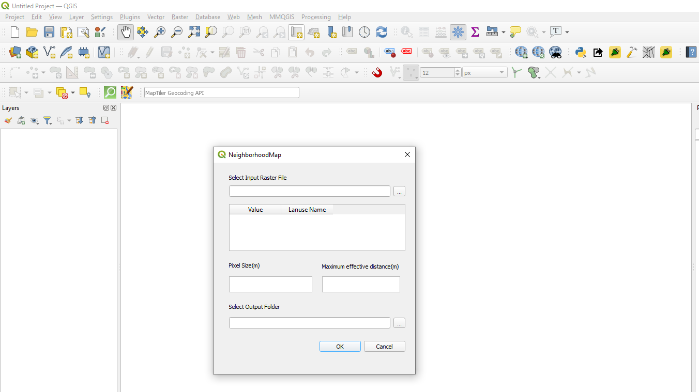

# NeighborhoodMap QGIS Plugin

## Overview
**NeighborhoodMap** is a QGIS plugin developed for a **Land Use Planning course** at **K.N. Toosi University of Technology (KNTU)** in Spring 2021. It allows users to generate neighborhood maps based on land use patterns in a raster file, using the rings method to analyze spatial relationships between different land uses.

## Features
- **Raster Analysis**: Uses raster data to map land use neighborhoods.
- **Configurable Parameters**: Accepts land use values and names, pixel size, and effective distance.
- **Custom Output**: Saves results to a specified output folder.

## Installation
1. Download the `.zip` file of the plugin.
2. Open QGIS, go to the Plugin Manager, and select "Install from ZIP."
3. Load the plugin and verify it appears in the plugins list.

## Usage
1. **Input Data**: Load the raster file and specify land use details, pixel size, and minimum effective distance.
2. **Generate Map**: Run the analysis, and the neighborhood map will be saved to the selected output folder.

## Requirements
- Compatible **QGIS** version
- Compatible **Python** version

## Screenshot
To see the plugin in action, view the screenshot:

